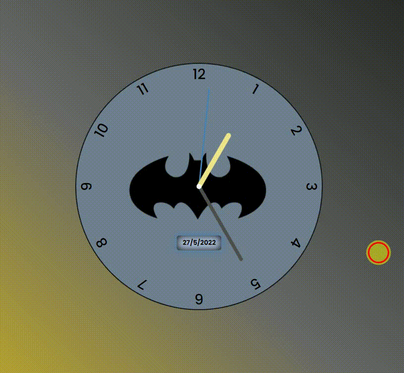

## Clock :clock130:

This is a batmans's clock made with html, css and javascript.



## How to run it

- Execute the follow command in git bash.

  ```
  git clone https://github.com/mateus-asouza/batman-clock
  ```

- Open the project folder and open the file index.html in your preferred browser.
